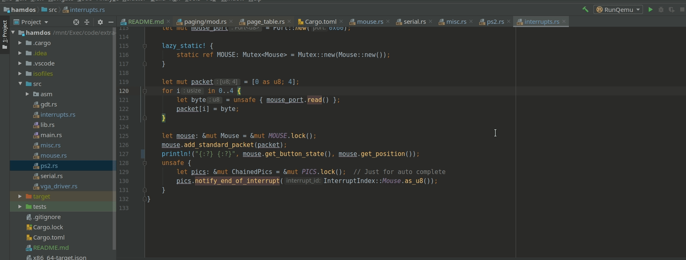

# HamdOS
A hobby operating system written in Rust. Mainly following [Philop RustOS blog](https://os.phil-opp.com) but I deviate when it's possible.

### What's done
- VGA driver (a bit deviant)
- Page fault handling
- Keyboard support
- PS2 controller and Mouse support (deviant, isn't covered by the blog)

#### Tiny Demo

The 2-stage-bootloader is [here](https://github.com/shakram02/TwoStageBootloader)
